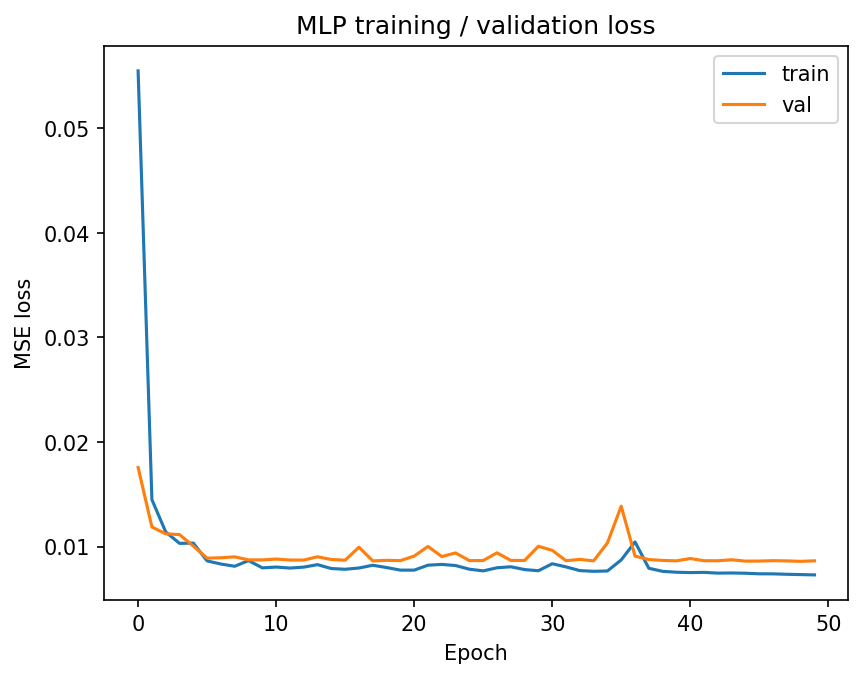
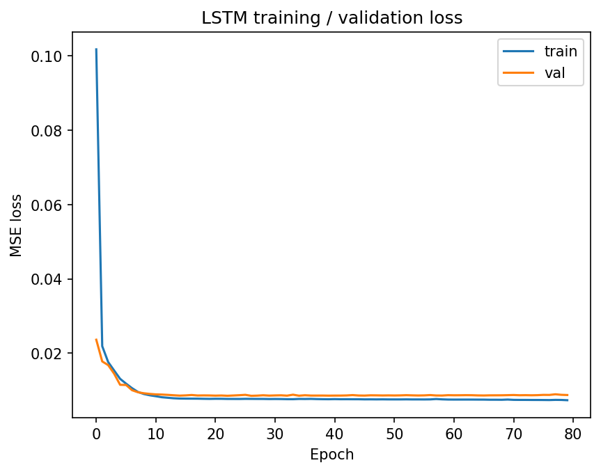
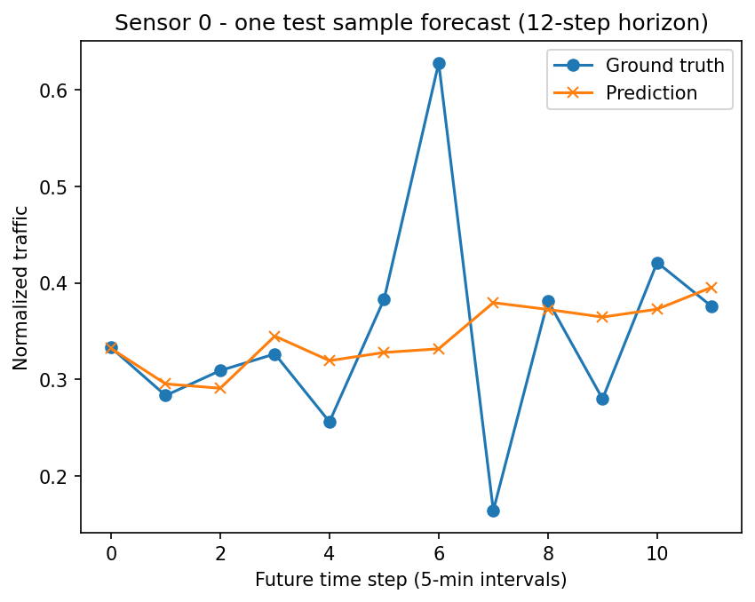
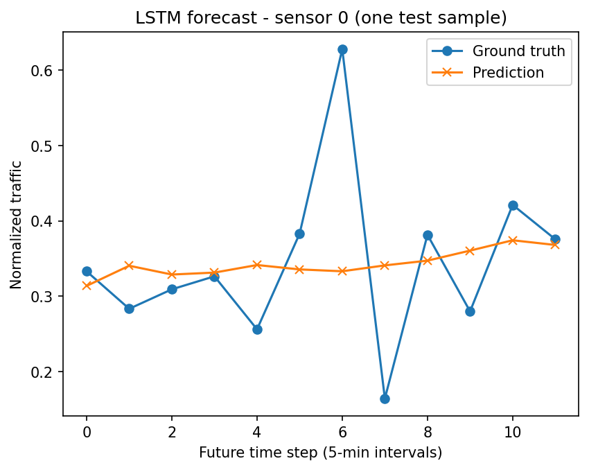

# 機器學習期末專題報告  
## 從交通流量預測出發，邁向「全自動、零死角、分散式」智慧交通系統

---

## 1. AI 的未來能力：全自動、零死角、分散式智慧交通系統

### 1.1 願景描述

我認為在未來 20 年內，AI 有機會實現一項對人類社會影響深遠的能力：

> **在真實城市中，同時協調數十萬台自駕車、行人、公共交通、紅綠燈與事故處理，形成「全自動、零死角、分散式」的智慧交通系統。**

這個系統（Fully Autonomous Distributed Traffic System, FADTS）不再只是「自動駕駛車」的集合，而是：

- 把整座城市視為一個**動態系統（dynamic system）**；
- 將所有道路、路口、車輛、行人、號誌視為**互相作用的智慧體（agents）**；
- 由 AI 即時協調，達成：
  - **低壅塞、高效率**（縮短通勤時間）  
  - **高安全性**（接近零交通死亡，Vision Zero）  
  - **更節能減碳**（減少不必要的停等與繞行）  

### 1.2 應用場景舉例

1. **早晚尖峰時段協調**
   - 系統可以預測 10–30 分鐘後哪些路段會壅塞；
   - 自動調整紅綠燈週期；
   - 重新規劃部分自駕車路線；
   - 通知公共運輸（公車、捷運接駁車）做適應性調整。

2. **事故或突發事件處理**
   - 即時偵測到事故後，自動：
     - 將該路段標記為高風險區；
     - 重新安排車輛繞行；
     - 優先讓救護車、消防車通過；
     - 更新全市車流預測，避免二次壅塞。

3. **大型活動與節慶**
   - 演唱會、球賽、跨年等活動結束後，人流與車流會瞬間暴增；
   - AI 能在活動開始前就根據票務與歷史資料，預測結束時間與散場模式；
   - 事先配置公車班次、自駕接駁車、路口管制策略。

### 1.3 為何這件事重要？

  - 減少道路事故與死亡人數；
  - 減少通勤時間，提升生活品質；
  - 降低能源消耗與碳排放。

### 1.4 為什麼現在做不到？

目前的 AI 與自駕車技術仍有幾個重大缺口：

1. **無法可靠預測「尖峰與異常」交通**  
   單純的時間序列預測模型，多半只能預測平滑趨勢，  
   對交通尖峰（spike）、事故、突發人潮等極端事件的預測能力有限。

2. **無法在城市級尺度協調龐大數量的智慧體**  
   同時控制 10⁵ 級別的自駕車＋公共運輸＋號誌，  
   對目前的 Multi-Agent RL 與分散式控制而言非常困難。

3. **缺乏完整、同步、多模態的城市資料**  
   感測器佈建不完整、資料延遲、不同系統之間缺乏統一標準。

4. **安全與可驗證性不足**  
   城市級交通控制系統不能「大致正確」，  
   必須對安全性與穩定性有嚴格的數學保證。

---

## 2. 實現此能力所需的成分（Ingredients）

為了實現上述願景，我將所需成分分成四大類：資料、工具、硬體與學習架構，並說明它們的角色與相依關係。

### 2.1 資料（Data）

1. **高頻率交通感測資料（Traffic Sensors / PeMS-like Data）**
   - 每條路段的流量、速度、車道占有率，時間解析度為 30 秒～5 分鐘。
   - 扮演角色：訓練時間序列模型、估計基礎交通狀態。

2. **道路拓樸與圖結構（Road Network as Graph）**
   - 節點：感測站 / 路口；
   - 邊：道路連接關係；
   - 對應 adjacency matrix 或加權圖。
   - 扮演角色：讓模型理解「壅塞如何沿網路傳播」。

3. **天氣與環境資料**
   - 降雨量、溫度、能見度、濕度等；
   - 用來解釋雨天與壞天氣下的交通模式變化。

4. **事件資料（Events）**
   - 演唱會、球賽、展覽、高峰旅遊季；
   - 可以來自票務系統、行事曆、社交媒體等。

5. **事故與施工資料**
   - 事故類型、發生位置與時間、處理進度；
   - 用於訓練異常偵測與事故預測模型。

這些資料必須被時間對齊（time alignment）、標準化與整理成可供模型使用的格式。

但這些東西目前還過於複雜所以我們將題目定調為監督式時間序列預測，基於這個主題，我們需要的工具有以下這些。

### 2.2 工具（Tools）

1. **時間序列模型（RNN / LSTM / GRU / Transformer）**
   - 用於建模交通量的時間依賴性與週期性。
   - 我在專題中使用的 LSTM 就是最基本的一種。

2. **機率與生成模型（Probabilistic & Generative Models）**
   - 對尖峰與稀有事件，輸出不是單一預測值，而是機率分布：

$$\hat{y}_t \sim p(y_t \mid x_{1:t})$$

   - 使用如 diffusion / score-based model，可以生成多種可能的未來交通情境。

3. **交通流體模型與偏微分方程（PDE-based Traffic Models）這次沒用到**
   - 例如 LWR 模型：

$$\frac{\partial \rho}{\partial t} + \frac{\partial q(\rho)}{\partial x} = 0$$

   - 將交通視為流體，描述壅塞波（shockwave）的傳播。

---

## 3. 涉及的機器學習類型與理由

### 3.1 監督式學習（Supervised Learning）

- 應用：  
  - 交通量預測（本專題的重點）  
  - 事故分類與異常偵測  
- 資料來源：  
  - 交通感測器數據（time-series）  
- 目標訊號（labels）：  
  - 未來流量值（迴歸問題）  
  - 是否發生事故（分類問題）

在這份作業中，我實作的是「監督式學習」的一個簡化問題：  
使用過去 12 個時間步的交通量資料，預測未來 12 個時間步的交通量。  

這是一個非常基礎但重要的能力：  
> 未來要做城市級交通控制，必須先能在局部（單一感測站）預測未來。

---

## 4. 第一階段可實作的模型問題（Solvable Model Problem）

### 4.1 問題設計與最終目標的關聯

最終願景：  
> 協調整座城市的多智能體交通系統。

但目前做不到，所以我設計的「第一步」是：

> **使用 PeMSD7 類型的資料，對單一感測站做短期交通流量預測。**

理由：

1. 城市級控制的基礎，是能對每個路段的未來需求有合理預期。  
2. 單點時間序列預測，是後續擴展到多感測器、整張圖上的基礎。  
3. 透過這個問題，可以觀察：
   - 模型對「平滑趨勢（daily pattern）」的擅長；
   - 對「尖峰（spike）」的無能為力；
   - 從而理解真正城市級 AI 需要什麼額外資訊。

### 4.2 資料與前處理

本專題中，我使用類似 PeMSD7 的合成資料（synthetic PeMS-like data），  
包含：

- 約一週的時間序列（每 5 分鐘一筆）；
- 每個感測站一個 traffic series；
- 共 228 個感測站。

資料前處理步驟：

1. **Min-Max Normalization**  
   針對每個感測站，以訓練集的最小值與最大值做縮放：

$$x' = \frac{x - x_{\min}}{x_{\max} - x_{\min}}$$

2. **Sliding Window**  
   設定：
   - 過去視窗長度：$L_{\text{past}} = 12$（1 小時）  
   - 預測視窗長度：$L_{\text{future}} = 12$（1 小時）  

   對每一條時間序列建立樣本：
   - 輸入： $X \in \mathbb{R}^{L_{\text{past}} \times N}$  
   - 輸出： $Y \in \mathbb{R}^{L_{\text{future}} \times N}$
   其中 $N$ 為感測站數量（例如 228）。

3. **Train / Validation / Test Split**  
   - 以時間為基準切分：
     - 前 60% 作為 training；
     - 中間 20% 作為 validation；
     - 最後 20% 作為 test。

### 4.3 模型與方法

我實作了兩個 baseline 模型：

#### (A) MLP（多層感知機，Fully-connected network）

1. 先把輸入展開為向量：

$$X \in \mathbb{R}^{L_{\text{past}} \times N} \;\to\; x_{\text{flat}} \in \mathbb{R}^{L_{\text{past}} \cdot N}$$

2. 經過兩層 fully-connected 網路：

$$
   h = \phi(W_1 x_{\text{flat}} + b_1), \\
   \hat{y}_{\text{flat}} = W_2 h + b_2
$$

   其中 $\phi$ 為 ReLU 非線性。

3. 再把輸出 reshape 回 $\mathbb{R}^{L_{\text{future}} \times N}$ 。

#### (B) LSTM（長短期記憶網路）

1. 將輸入視為時間序列：

$$x_t \in \mathbb{R}^N, \quad t = 1, \dots, L_{\text{past}}$$

2. 使用單向 LSTM：

$$
   h_t, c_t = \text{LSTM}(x_t, h_{t-1}, c_{t-1})
$$

   取最後的 hidden state $$h_{L_{\text{past}}}$$。

3. 使用線性層從 $$h_{L_{\text{past}}}$$ 預測未來 12 步的展開向量。

### 4.4 損失函數（Loss Function）

對每個樣本，使用 MSE (Mean Squared Error)：

$$
\mathcal{L} = \frac{1}{L_{\text{future}} \cdot N} \sum_{t=1}^{L_{\text{future}}}\sum_{i=1}^N \left( y_{t,i} - \hat{y}_{t,i} \right)^2
$$

訓練過程中，對所有 batch 取平均。

### 4.5 實作與結果

#### (A) Loss 曲線

- MLP 與 LSTM 都呈現穩定收斂；
- 訓練損失與驗證損失相近，代表沒有明顯 overfitting；
- 強化版 LSTM（更大 hidden size、更多層）也能穩定收斂。

#### (B) 性能指標（RMSE / MAE）

在 Min-Max normalized 空間中，測試集上的結果整理如下：

- **MLP baseline**
  - Test RMSE ≈ 0.0915  
  - Test MAE  ≈ 0.0676  

- **原始 LSTM（單層、hidden=128）**
  - Test RMSE ≈ 0.0967  
  - Test MAE  ≈ 0.0721  

- **強化版 LSTM（兩層、hidden=256、訓練較久）**
  - Test RMSE ≈ 0.0954  
  - Test MAE  ≈ 0.0707  

可以看到：

- LSTM 的表現並沒有顯著優於 MLP；
- 強化版 LSTM 雖有小幅度改善，但仍未超越 MLP；
- 在此合成資料設定下，LSTM 未展現明顯優勢。

#### (C) 預測 vs 真實值（Prediction vs Ground Truth）

選取某一感測站與一個測試樣本，可以看到：

- 模型對於**整體趨勢**（上升或下降）有合理預測；
- 但對於**尖峰（spike）** 的部分，預測曲線通常偏平滑、無法跟上真實值的尖銳變化。

### 4.6 討論：從這個簡化問題學到什麼？

#### 4.6.1 為何 spike 難以預測？

在本專題使用的合成資料中，尖峰多半是以「隨機事件」的方式加入：

- 並非由過去流量的 deterministic pattern 決定；
- 而是類似「擲骰子」產生的 incident。

在這種設定下，即使使用 LSTM：

- 模型能學到 daily pattern（早晚高峰）；
- 但無法「事前知道」哪一個時間點會出現異常尖峰。

在 MSE 的觀點下，對不可預測的隨機事件，最佳策略是「預測平均值」，  
因此模型會輸出平滑曲線，而不是去「猜尖峰」。

這說明了一個重要觀念：

> **如果事件本身是高度隨機，且沒有出現在輸入特徵中，  
> 再強大的模型也無法預測它，只會學到一個平滑的期望值。**

這與未來城市級 AI 的需求形成鮮明對比：  
要預測真實城市中的 spike，必須加入更多可解釋其成因的特徵（天氣、事件、鄰近路段狀態等）。

#### 4.6.2 單點時間序列的局限

本專題專注於「單點或全體感測站各自的時間序列」，  
但現實中的交通現象具有強烈的**空間相依性**：

- 上游壅塞會影響下游；
- 一條幹道壅塞會導致鄰近小路出現繞行車流。

因此，真正要預測 spike 與壅塞 propagation，需要模型同時考慮：

- **空間維度（Graph）**：GNN、GCN、Graph Transformer；  
- **時間維度（Temporal）**：LSTM、GRU、Temporal Convolution。

#### 4.6.3 可改善方向：如何讓模型更擅長預測尖峰？

基於本次實驗經驗，我認為以下方向有助於改善尖峰預測：

1. **資料層面**
   - 在合成資料中，讓尖峰與：
     - time-of-day（例如 8:00, 18:00）、  
     - day-of-week、  
     - 或鄰近路段壅塞  
     產生某種關聯，而不只是純隨機。
   - 這樣 LSTM 或其他時序模型才有機會「學到尖峰的前兆」。

2. **特徵工程**
   - 加入額外特徵：  
     - 是否為假日 / 是否有大型活動。

3. **Loss 設計**
   - 對高流量區間給予較大的權重，例如：
   
$$
     \mathcal{L} = \frac{1}{N} \sum_{t,i} w_{t,i} (y_{t,i} - \hat{y}_{t,i})^2, \\
     w_{t,i} = 1 + \alpha \cdot \mathbf{1}[y_{t,i} > \tau]
$$

   - 讓模型把錯過尖峰視為「更嚴重的錯」。

4. **模型架構**
   - 將 GNN 與 LSTM 結合（簡化版 ST-GCN），利用鄰近感測站資訊；
   - 或使用更適合長序列與多維序列的架構（如 Temporal Convolution / Transformer）。

---

## 5. 結論與未來展望

### 5.1 結論

在本次專題中，我從一個遠大的願景出發：

> **未來 20 年內，AI 有機會實現全自動、零死角、分散式的智慧交通系統，協調整座城市的車流與人流。**

然而，現階段的技術與資料仍無法直接達成這個目標。  
因此，我設計並實作了一個可行的「第一步」：

- 使用（合成）PeMSD7 類型的交通資料；
- 建立時間序列預測模型（MLP 與 LSTM）；
- 探討模型在預測 traffic spike 上的侷限。

透過實作與分析，我學到：

1. **MLP 與 LSTM 都能學到平滑的交通趨勢，但無法可靠預測尖峰。**  
2. **LSTM 容量增加（hidden size、層數）只帶來有限的改善，無法解決 spike 問題。**  
3. **尖峰預測需要的不只是更大的模型，而是更多元的資料與更貼近真實物理與結構的模型。**

### 5.2 與未來城市級 AI 的關聯

這個簡化問題揭示了未來要解決的大問題中的關鍵面向：

- 單一序列的時間資訊是不夠的；
- 需要結合圖結構（道路網路）、事件資料、事故與天氣資訊；
- 模型必須能處理**不確定性**與**稀有事件**；
- 最後更須結合**多智能體強化學習**，從「預測未來」走向「控制未來」。

### 5.3 未來方向

如果未來有更多時間與資源，我希望逐步往下列方向延伸：

1. **使用真實 PeMSD7 資料，而非合成資料**；
2. **實作簡化版 GNN + LSTM 模型，整合圖結構資訊**；
3. **引入事件／天氣資料，嘗試預測更接近現實的尖峰模式**；
4. **在模擬環境中，設計簡單的 multi-agent 交通控制任務，讓 RL 參與決策**。

最終，希望從「單點流量預測」一路推進到可以支撐：

> **在真實城市中協調數十萬智慧體的、全自動、零死角、分散式智慧交通系統。**
